# PJT_BlueShelter

정신의료서비스 수요자와 공급자의 상호소통 플랫폼

---

## 1. 프로젝트 개요

- 프로젝트 기간 : 2022.07.28 ~ 2022.08.17
- 프로젝트 팀 
  - 팀장 : 문영롱
  - 팀원 : 고유정, 송원혁, 우성균, 이우주
- 프로젝트 소개 
  - Django 기반의 웹 서비스 구현을 통해 정신의료서비스 이용자와 제공자의 상호소통 플랫폼 구축.
- 수행 도구 
  - 데이터 수집 및 처리 : Python
  - 데이터 적재 : MySQL
  - 시각화 : Django, HTML5, CSS, JavaScript
  - 협업툴 : Slack, Notion

## 2. 프로세싱

### 2.1. 데이터 수집 및 가공

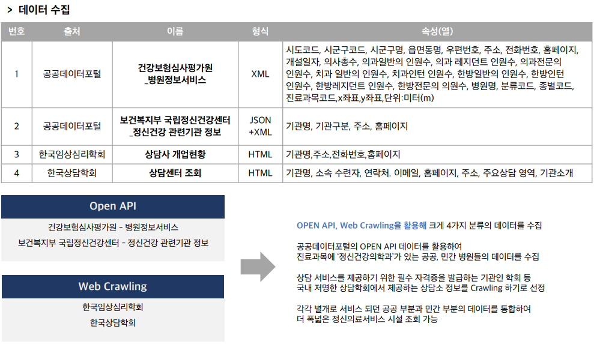

### 2.2. 데이터베이스 설계

## 3. 서비스 프로세스

### 3.1. 일반 이용자 서비스 프로세스

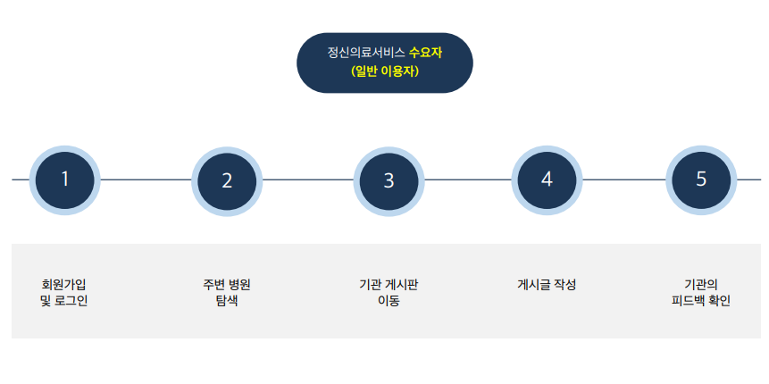

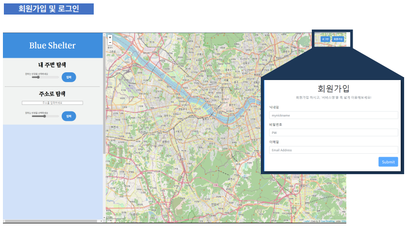

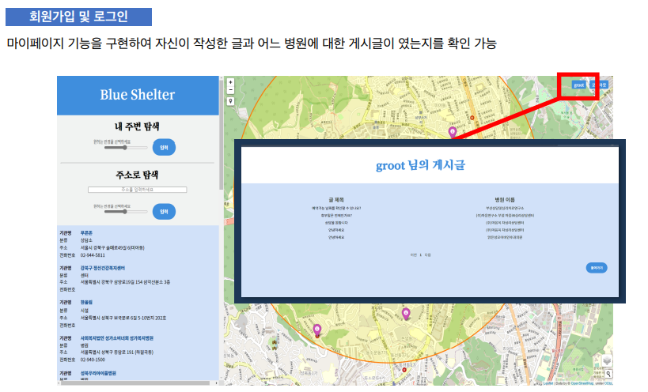

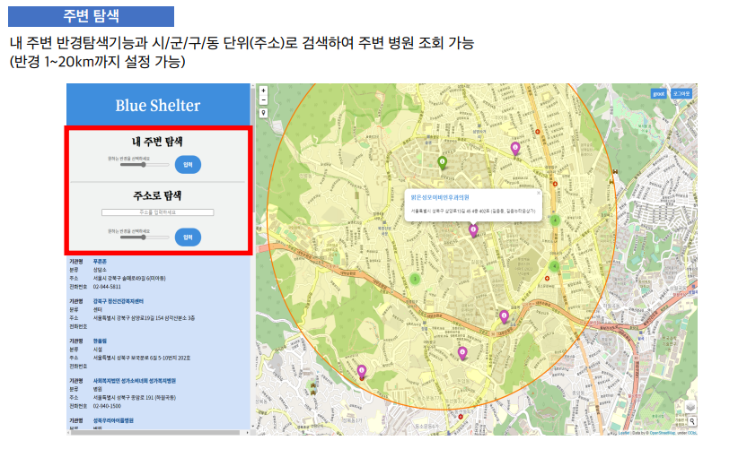

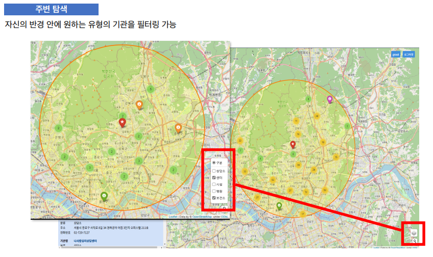

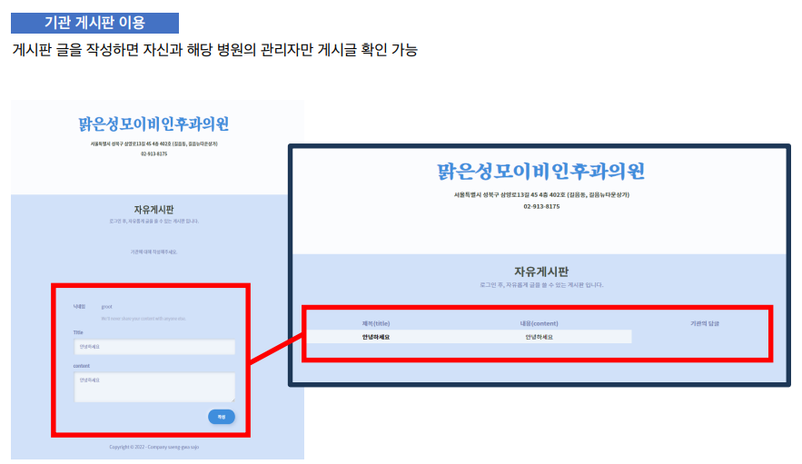

### 3.2. 기관 이용자 서비스 프로세스

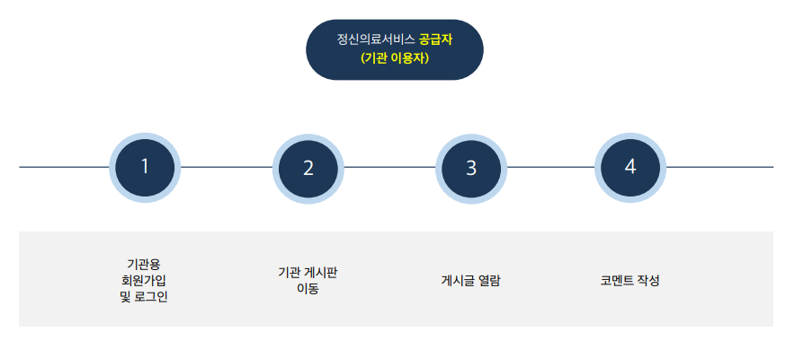

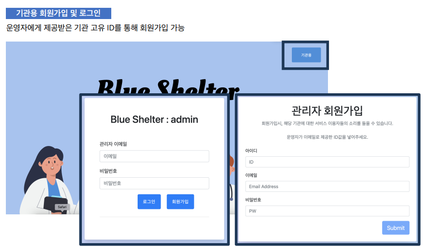

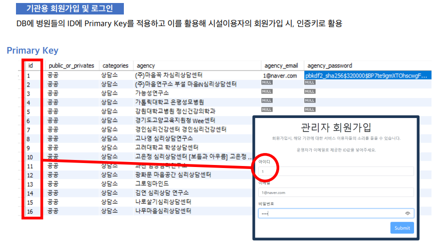

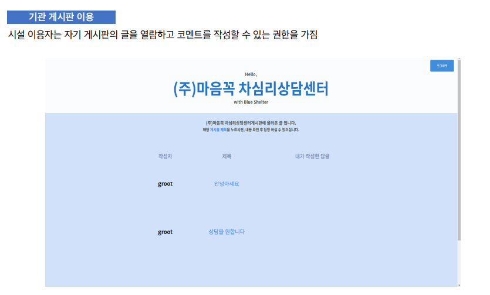

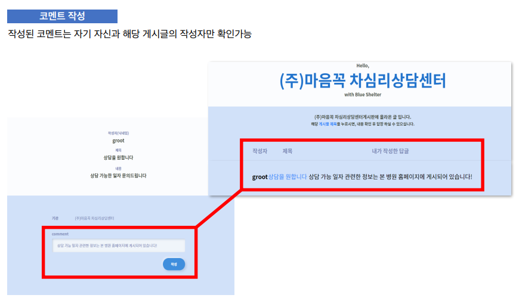

## 4. 프로젝트 후기

### 4.1. 개발 후기 및 느낀점

- 처음 기획 의도와 달리 데이터를 분석하는 과정 중 지방 자치단체와 대도심의 의료자원 격차와 정신질환 발생의 연관성 분석에 필요한 데이터가 부족해서 서비스만 구현하게 된 것이 아쉬웠다.

- 자원이 부족한 상황에서 팀원들이랑 지금 할 수 있는 일에 집중하여 완성한 것 을 통해 협업의 중요성을 알게 된 시간이었다.

  

### 4.2. 참고문헌

- 통계 및 사진 자료  
  - 보건복지부 2016년 정신질환실태 조사  
  - 김종태·채정호 한국의 정신질환 치료격차 감소를 위한 전략
  - 가톨릭대학교 의과대학 서울성모병원 정신건강의학교실 
- 원본 데이터  출처
  - https://www.data.go.kr/tcs/dss/selectApiDataDetailView.do?publicDataPk=15001698  
  - https://www.data.go.kr/data/3049990/fileData.do#/tab-layer-openapi  
  - https://www.kcp.or.kr/new/psychologistManagement/list.asp?listType=2  
  - https://counselors.or.kr  
  - https://jumin.mois.go.kr/
